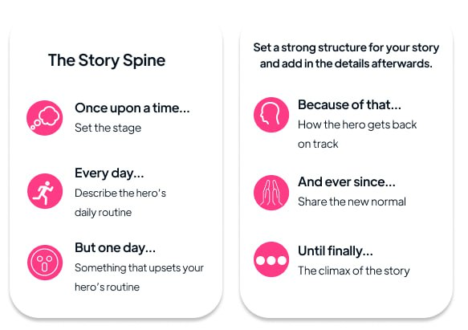

# Example Showcase

## Examples
Explore summary examples for these well-known titles:
- [**And Then There Were None** by Agatha Christie](./and-then-there-were-none.md): 3 different summaries (Pixar Style, Default, Extended)
- [**Harry Potter and the Sorcerer’s Stone** by J.K. Rowling](./harry-potter-and-the-sorcerers-stone.md): 3 different summaries (Pixar Style, Default, Extended)
- [**How to Win Friends and Influence People** by Dale Carnegie](./how-to-win-friends-and-influence-people.md): Extended
- [**Outliers** by Malcolm Gladwell](./outliers.md): Extended

## Summary Styles

### Pixar Style *(The Story Spine)*
A playful, story-driven summary inspired by Pixar's storytelling formula:

### Default (Neutral)
Concise, neutral summaries ideal for quick refreshers or general overviews.

### Extended (Deep Dive)
Comprehensive summaries capturing detailed insights and main points, perfect for nonfiction recall and in-depth understanding.
